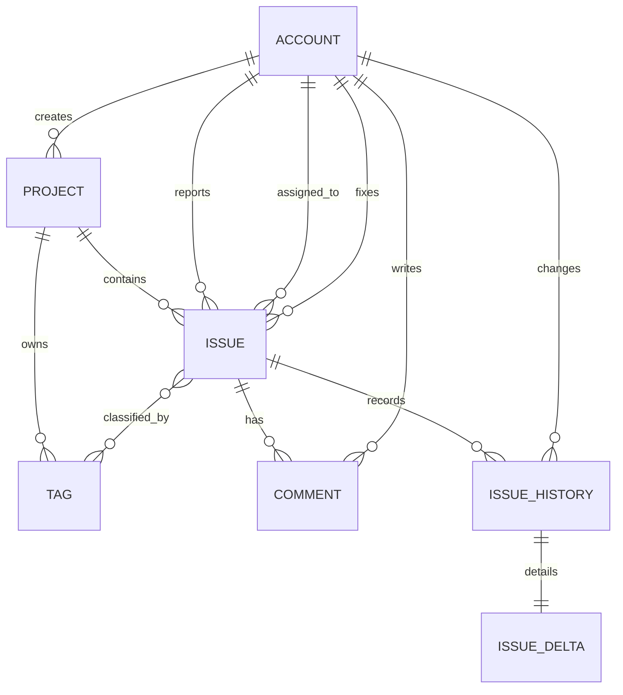

# Entity Relationship

## ERD

## Tables

- `accounts`: 사용자 계정. 전역 role과 활성화 여부를 관리합니다.
- `projects`: 이슈와 태그의 상위 컨텍스트입니다.
- `issues`: 상태, 우선순위, reporter/assignee/fixer를 포함한 핵심 이슈 테이블입니다.
- `comments`: 이슈 댓글과 검증/지연 사유 같은 기록을 저장합니다.
- `tags`: 프로젝트 단위 태그입니다. 같은 프로젝트 내에서만 이름이 유일합니다.
- `issue_histories`: 이슈 변경 이력과 변경 주체, 변경 시각을 저장하는 감사 로그입니다.
- `issue_deltas`: 실제 변경 전후 값을 보관하는 상세 변경 정보입니다.
- `issue_tags`: `Issue` 와 `Tag` 의 다대다 연결 테이블입니다.

## Design Decisions

- `role`, `priority`, `status` 는 모두 `TEXT + CHECK` 제약으로 고정값을 강제합니다.
- `Issue` 는 삭제하지 않는 방향이므로 계정 참조는 대부분 `ON DELETE RESTRICT` 로 두었습니다.
- 프로젝트 삭제 시 하위 `Issue`, `Tag`, `Comment`, `IssueHistory`, `IssueDelta`, `issue_tags` 는 함께 정리될 수 있도록 `CASCADE` 를 사용하는 방향이 자연스럽습니다.
- account 삭제 요구사항과 데이터 보존 요구가 충돌할 수 있어, 실제 운영에서는 물리 삭제보다 `is_active = false` 비활성화를 권장합니다.
